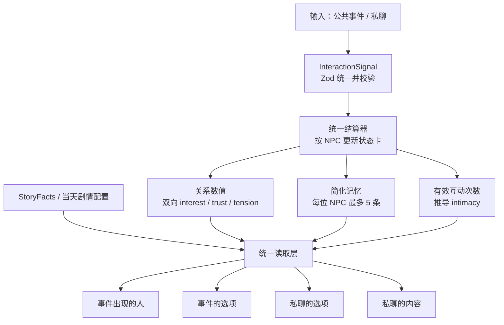

# NPC 状态、简化记忆与统一输出系统 Spec

> 状态：阶段 1～5 与公共事件读取地基已实施并完成回归；阶段 6 的 Day 5～7 全量配置化、阶段 7 旧兼容清理待后续 PR 继续  
> 版本：v1.0  
> 适用范围：`frontend` 七日公共事件与私聊系统  
> 核心目标：用尽可能简单、可解释、可存档的状态系统，让“事件出现的人、事件选项、私聊选项、私聊内容”同时读取关系数值与该 NPC 的近期记忆。

## 1. 背景与现状

当前公共事件已经能读取双向好感与 `WorldFacts`，据此选择部分人物、判断选项条件并结算；私聊能够读取 NPC 人设、单一好感和当前聊天窗口内的最近消息。但两条链路尚未统一：

- 持久化关系只有 `toNpc / fromNpc`，没有按 NPC 保存的信任、张力和软记忆。
- 公共事件直接结算好感与事实，私聊记录停留在组件状态中，不能跨天影响剧情。
- 私聊选项是全员共用的固定话题。
- 四类输出没有统一的状态读取入口。

本规格在保留现有七日事件、规则引擎、人物 prompt 与 `StoryFacts` 的前提下补齐统一数据管道，不引入 Mem0、向量数据库、Embedding 或新的工作流框架。

## 2. 目标架构



### 2.1 设计原则

1. **规则拥有决定权**：事件人物、选项可用性、关系数值、关键事实和结局均由确定性代码决定。
2. **软记忆只丰富上下文**：记忆可影响候选排序、文案和 NPC 表达，但不能取代关键事实或直接决定结局。
3. **单一写入口**：事件与私聊都必须先产生合法的 `InteractionSignal`，再更新状态。
4. **单一读入口**：四类输出不直接拼装 Store 字段，统一通过读取层获得所需上下文。
5. **按 NPC 隔离**：私密互动和记忆只对目标 NPC 可见，其他 NPC 不得自动获知。
6. **渐进迁移**：旧事件与结局代码通过兼容选择器继续运行，逐步迁移，不一次性重写。

## 3. 范围与非目标

### 3.1 本期范围

- Zod 定义并校验 `InteractionSignal`。
- 每位 NPC 一张持久化状态卡。
- `interest / trust / tension / interactionCount` 更新与 `intimacy` 派生。
- 每位 NPC 最多 5 条简化记忆。
- `WorldFacts` 保持独立，作为关键剧情事实来源。
- 四类输出统一读取关系、记忆、事实与当天配置。
- Zustand persist v1 → v2 无损迁移。
- 一个 Day 1 纵向样板，随后逐步迁移私聊与 Day 1～7 事件。
- 单元、集成、回归与降级测试。

### 3.2 非目标

- 不接入 Mem0、Supermemory 或其他外部记忆服务。
- 不做语义向量检索、知识图谱或无限聊天历史。
- 不让 LLM 直接写关系数值、关键事实、派生角色或结局。
- 不在本期重写 21 个事件的剧情内容和 UI 视觉。
- 不把现有第五天资源 `trust_points` 改造成 NPC 信任值；两者名称相近但语义独立。
- 不把事件配置中的 `tension` 剧情强度当作某位 NPC 的关系张力。

## 4. 权威数据模型

以下类型为目标契约；具体文件名可在实施时按现有目录边界调整，但语义不得分叉。

### 4.1 NPC 状态卡

```ts
interface NpcStateCard {
  npcId: string;
  interest: {
    playerToNpc: number;
    npcToPlayer: number;
  };
  trust: number;
  tension: number;
  interactionCount: number;
  memories: MemoryNote[];
}
```

约束：

- `interest.playerToNpc`、`interest.npcToPlayer`、`trust`、`tension` 均为 `0..100` 整数，写入时钳位。
- 新局初始双向 `interest` 沿用当前值 `30 / 30`；`trust = 30`、`tension = 0`、`interactionCount = 0`、`memories = []`。
- `interactionCount` 只统计已成功结算且 `strength > 0` 的目标 NPC 互动；一条多人效果拆成多条单 NPC 信号。
- `intimacy` 不持久化，统一派生：`min(100, interactionCount * 10)`。
- 状态卡是实现概念，不要求新增可见 UI 卡片。

### 4.2 简化记忆

```ts
type MemoryTag =
  "chat" | "support" | "promise" | "date" | "conflict" | "rejection" | "secret";

interface MemoryNote {
  id: string;
  day: number;
  source: "public_event" | "private_chat";
  tag: MemoryTag;
  text: string;
  visibility: "private" | "public";
  createdAt: number;
}
```

记忆规则：

- 每位 NPC 最多保存 5 条；写入第 6 条时删除最旧的一条。
- 公共事件的记忆文案由事件配置提供，保证稳定、可测试。
- 私聊每次结束最多形成 1 条简短记忆；AI 可生成候选摘要，但必须经过 Zod 校验、长度限制和失败降级。
- 相同 `id` 不重复写入；同一天、同来源、同标签且文本相同的记忆视为重复。
- `private` 记忆只进入该 NPC 的读取上下文；`public` 也不会自动复制给所有 NPC，跨 NPC 知情必须由 `StoryFacts` 或事件规则显式表达。
- 约会对象、承诺、拒绝、投票、秘密是否泄露等会影响规则或结局的内容，必须另写 `StoryFacts`；记忆文本不是其权威来源。

### 4.3 InteractionSignal

```ts
type InteractionSource = "public_event" | "private_chat";
type InteractionValence = "positive" | "negative" | "mixed" | "neutral";
type InteractionStrength = 0 | 1 | 2 | 3;

interface InteractionSignal {
  id: string;
  source: InteractionSource;
  day: number;
  targetNpcId: string;
  intent: string;
  valence: InteractionValence;
  strength: InteractionStrength;
  visibility: "private" | "public";
  relationshipDelta?: {
    playerInterest?: number;
    npcInterest?: number;
    trust?: number;
    tension?: number;
  };
  memory?: Omit<MemoryNote, "id" | "day" | "source" | "createdAt">;
  provenance: {
    eventId?: string;
    optionId?: string;
    chatSessionId?: string;
  };
}
```

Zod 必须在写入 Store 前校验：

- ID 非空且本局未结算；`targetNpcId` 必须属于当前 NPC 名单。
- `day` 为 `1..7`，`strength` 为枚举，数值变化均为有限整数并受安全上限约束。
- 公共事件必须携带 `eventId / optionId`；私聊必须携带 `chatSessionId`。
- 公共事件可由受信任的事件配置携带 `relationshipDelta`，用于无损承接现有 `delta` 平衡。
- 私聊不得接受客户端或 LLM 自由提供的 `relationshipDelta`；私聊数值变化由本地固定映射根据 `intent / valence / strength` 计算。
- 私聊默认 `visibility = private`；公共事件默认 `visibility = public`。
- `memory.text` 去除首尾空白后必须非空并限制长度；非法字段拒绝而非静默写入。

### 4.4 StoryFacts

现有 `worldFacts` 在概念上承担 `StoryFacts` 职责，本期不将其合并进状态卡。它继续保存影响规则、资源或结局的权威事实，例如约会对象、邀请人、承诺、拒绝、表态和秘密泄露。

读取优先级固定为：

```text
StoryFacts > 确定性派生状态/角色 > NPC 状态卡 > 软记忆 > 人设 > 稳定随机兜底
```

当软记忆与 `StoryFacts` 冲突时，必须忽略冲突记忆，并在开发环境记录诊断信息。

## 5. 统一结算器

唯一公开写入口建议为：

```ts
applyInteractionSignal(signal: unknown): ApplySignalResult
applyInteractionSignals(signals: unknown[]): ApplySignalResult[]
```

结算顺序固定：

1. Zod 解析并校验信号。
2. 校验目标 NPC、来源权限和 provenance。
3. 通过 `appliedSignalIds` 检查幂等；已处理信号返回 `duplicate`，不重复结算。
4. 公共事件沿用受信任配置中的关系变化；私聊使用固定映射生成变化。
5. 所有数值钳位到 `0..100`。
6. `strength > 0` 时将目标 NPC 的 `interactionCount` 增加 1。
7. 有合法 `memory` 时去重、追加并裁剪为最近 5 条。
8. 原子提交状态；失败时不得留下部分数值或部分记忆。

`appliedSignalIds` 为本局全局的轻量幂等集合，不属于 NPC 状态卡。七日数据量有限，本期直接随存档保存，无需建立完整信号账本。

### 5.1 私聊固定映射

第一版保持保守：预设话题由配置声明 `intent / valence / strength`；自由输入默认仅生成 `strength = 1` 的轻量互动。AI 可以分类和总结，但不能决定变化幅度。映射规则应集中在一个纯函数中并有表格测试，例如：

- 正向支持：增加 NPC→玩家 interest 与 trust，降低 tension。
- 轻度试探：小幅增加双向 interest；若已有冲突可小幅增加 tension。
- 道歉/修复：增加 trust，降低 tension。
- 冒犯/拒绝：降低 NPC→玩家 interest 或 trust，增加 tension。
- neutral：不改数值，但可计入有效互动并形成普通聊天记忆。

所有具体 delta 在实现前集中成常量表，禁止散落在组件或 API route 中。

## 6. 统一读取层

读取层是纯函数/selector，不修改状态，不调用 LLM：

```ts
interface NpcOutputContext {
  npcId: string;
  interest: NpcStateCard["interest"];
  trust: number;
  tension: number;
  intimacy: number;
  interactionCount: number;
  memories: MemoryNote[];
  visibleFacts: Record<string, unknown>;
  relationLabels: string[];
}

getNpcOutputContext(npcId: string, purpose: OutputPurpose): NpcOutputContext;
getAllNpcOutputContexts(purpose: OutputPurpose): NpcOutputContext[];
```

`purpose` 至少区分 `event_cast / event_choices / chat_choices / chat_content`，以便执行可见性过滤。传给 LLM 时不暴露原始隐藏分数，而转换为有限的关系描述，例如“对玩家有明显兴趣”“信任尚浅”“仍有未化解的张力”。

### 6.1 四类输出的读取要求

| 输出         | 读取范围                                                          | 决定方式                                     | 记忆的作用                                                |
| ------------ | ----------------------------------------------------------------- | -------------------------------------------- | --------------------------------------------------------- |
| 事件出现的人 | 所有候选 NPC 的状态卡、可见事实、当天事件配置                     | 规则引擎排序、门槛与派生角色；确定性并列规则 | 匹配事件声明的记忆标签时提供加权或文案依据                |
| 事件的选项   | 本事件相关 NPC 状态、记忆、事实、资源与配置                       | 规则决定出现、解锁、灰显和效果               | 选择配置中的记忆文案变体；不得凭自由文本开启关键分支      |
| 私聊的选项   | 目标 NPC 状态、最近记忆、事实、当天配置                           | 本地规则生成 3 个推荐话题，并保留自由输入    | 冲突→修复、秘密→关心、高 interest→试探、无上下文→通用话题 |
| 私聊的内容   | 目标 NPC 状态、最近 5 条记忆、可见事实、本轮最近消息与人物 prompt | LLM 负责表达，规则负责上下文边界             | 允许自然回忆和态度变化，不得捏造事实或说出隐藏分数        |

四类输出均须通过读取层取得状态；不得以“当前暂时没用到某字段”为由绕过读取层。某一字段对结果无影响时可保持中性权重，但必须在上下文中可用且有测试证明接线存在。

## 7. 派生关系角色

`primary / mutual / trusted / inviter / hurtNpc / unfinished` 是按需计算的剧情角色，不作为额外数值存档。角色计算读取状态卡、近期信号摘要和 `StoryFacts`，事件开始时锁定到事件会话，避免一次事件中人物漂移。

本期实施重点是打通状态与四类输出；角色公式沿用单独的 Relationship Engine 设计。最低接入顺序：

- Day 4：`primary / inviter`。
- Day 5：`trusted`。
- Day 6：`mutual / hurtNpc`。
- Day 7：`primary / mutual / unfinished`。

候选不满足门槛时允许返回 `null` 或少于期望人数，禁止为了填满剧情名额选择不合格 NPC。

## 8. Store v1 → v2 迁移

Zustand persist 版本升级为 `2`，迁移必须为纯函数并覆盖测试。

### 8.1 字段映射

对本局 `npcIds` 中每位 NPC：

```text
relationships[npcId].toNpc   → npcStates[npcId].interest.playerToNpc
relationships[npcId].fromNpc → npcStates[npcId].interest.npcToPlayer
trust                        → 30
tension                      → 0
interactionCount             → 从 eventLog 中该 NPC 的非零 delta 记录计数
memories                     → []
```

无法从旧存档可靠恢复的记忆不做猜测。旧 `eventLog`、`worldFacts`、资源、天数、事件索引、结局和序号原样保留。

### 8.2 渐进兼容

- v2 以 `npcStates` 为唯一权威关系数据。
- 提供只读兼容 selector，将状态卡投影为旧 `{ toNpc, fromNpc }` 结构，供 `turnRunner`、结局、报告页和旧测试逐步迁移。
- 禁止同时维护两份可写关系数据，避免状态分叉。
- 迁移完成前不得删除兼容 selector；全部调用点迁移并通过回归后再清理。
- 若 v1 数据损坏或 NPC 缺失，只对缺失 NPC 使用新局默认值，不重置整局。

## 9. 实施顺序

### 阶段 1：数据契约与纯函数地基

1. 新增 Zod schema、类型与 parse helper。
2. 新增状态卡默认值、数值钳位、intimacy 派生、记忆去重/裁剪纯函数。
3. 为上述函数先写单元测试。

完成标志：不接 UI 也能用测试证明合法信号可结算、非法信号不落库、记忆最多 5 条。

### 阶段 2：Store v2 与兼容层

1. 新增 `npcStates` 与 `appliedSignalIds`。
2. 实现 v1 → v2 migration。
3. 实现 `applyInteractionSignal(s)` 原子写入口。
4. 添加旧关系结构只读 selector，保持当前事件、结局与报告可运行。

完成标志：旧存档恢复后关键状态不丢失，现有七日流程行为不变。

### 阶段 3：统一读取层

1. 实现单 NPC 与全候选读取接口。
2. 实现事实与记忆可见性过滤。
3. 实现隐藏数值到自然语言标签的转换。
4. 让四个消费入口只通过读取层取上下文，即使部分规则仍为旧逻辑。

完成标志：测试替换某位 NPC 状态后，四个入口取得的新上下文都同步变化。

### 阶段 4：Day 1 纵向样板

选择 Day 1 一个公共事件和一个 NPC 私聊，完整打通：

```text
事件选项 → InteractionSignal → 状态卡/记忆
→ 后续事件人物或选项变化
→ 私聊推荐话题变化
→ NPC 对话能引用刚发生的事
```

完成标志：四类输出在真实 UI 流程中全部受到同一状态影响，刷新后仍保持，重看不重复结算。

### 阶段 5：完整私聊接入

1. 私聊 prompt 读取状态卡、最近 5 条记忆与可见事实。
2. 固定三个话题改为按状态生成的三个推荐话题，保留通用兜底与自由输入。
3. 预设话题通过固定映射产生信号。
4. 自由输入只产生轻量信号；每个聊天会话结束最多总结一条记忆。
5. API 或 AI 失败时使用固定回复、固定话题和无记忆降级，游戏仍可继续。

### 阶段 6：完整公共事件接入

按风险从低到高迁移：

1. Day 1～3：基础 interest、trust、tension 与记忆标签。
2. Day 4～5：邀请、约会、信任相关人物和选项。
3. Day 6～7：互选、受伤、未完结关系与结局。

每个事件配置应显式声明：读取哪些关系角色/阈值、哪些记忆标签影响人物或文案、结算产生哪些信号与记忆、写入哪些 `StoryFacts`。

### 阶段 7：移除旧写路径与回归

1. 搜索并移除组件、事件钩子和 API 中对旧关系字段的直接写入。
2. 保留必要只读兼容直到结局和报告页完成迁移。
3. 跑完单元、集成、21 事件 smoke、构建和关键手测。

## 10. 预计文件边界

实施时优先形成以下职责，而非强制完全相同的命名：

```text
frontend/src/core/interactionSignal.ts       Zod schema 与 parse
frontend/src/core/npcState.ts                状态卡纯函数、intimacy、记忆裁剪
frontend/src/core/relationshipEngine.ts      私聊映射与派生角色
frontend/src/core/outputContext.ts           统一读取层与可见性过滤
frontend/src/stores/useIslandStore.ts        v2 persist、迁移、唯一写入口
frontend/src/data/chatTopics.ts              动态话题规则与兜底
frontend/src/data/events/day1..7.ts           事件信号/记忆配置
frontend/src/components/EventFlow.tsx        公共事件消费读取层
frontend/src/components/HouseApp.tsx         私聊选项、会话提交与展示
frontend/src/routes/api.chat.ts               私聊内容上下文与安全输出
```

测试应靠近纯函数或放入现有 smoke 体系；避免只用端到端测试覆盖所有规则。

## 11. 验收标准

### 11.1 数据与幂等

- [ ] 公共事件和私聊都通过同一个 Zod schema 与统一结算入口。
- [ ] 非法 NPC、非法 day/strength、越权 delta、缺失 provenance 的信号不会改变状态。
- [ ] 同一信号重复提交不会重复加数值、互动次数或记忆。
- [ ] 所有关系数值始终在 `0..100`；`intimacy` 只由互动次数派生且不存档。
- [ ] 每位 NPC 记忆最多 5 条，重复记忆不重复保存。

### 11.2 隔离与事实

- [ ] 私聊记忆跨刷新、跨天保留。
- [ ] NPC A 的私密记忆不会出现在 NPC B 的上下文或 prompt。
- [ ] 关键剧情事实仍由 `StoryFacts` 决定；软记忆与事实冲突时事实优先。
- [ ] LLM 无法直接修改关系数值、事实、派生角色或结局。

### 11.3 四类输出

- [ ] 改变候选 NPC 状态后，“事件出现的人”的规则输入同步变化。
- [ ] 改变相关 NPC 状态或记忆标签后，“事件选项”的出现、状态或文案按配置变化。
- [ ] 冲突、秘密、高 interest 和无上下文四种状态能生成不同且正确的私聊选项。
- [ ] 私聊内容能自然使用目标 NPC 的最近记忆和关系描述，不说出隐藏分数、不串线。
- [ ] 四个入口都通过统一读取层，禁止单独读取一套影子状态。

### 11.4 兼容与回归

- [ ] v1 存档迁移到 v2 后双向好感、天数、事件进度、资源、事实与结局状态不丢失。
- [ ] 重看或刷新公共事件不重复结算。
- [ ] 21 个公共事件仍能完整运行，现有结局与报告页结果不回退。
- [ ] AI 不可用或返回非法结构时，固定选项/回复兜底可让游戏继续。
- [ ] TypeScript、lint、单元/集成/smoke 与生产构建通过。

## 12. 完成定义

只有同时满足以下条件，才算达到本规格的理想状态：

1. 两类输入都已统一为合法 `InteractionSignal` 并由唯一入口结算。
2. 每位 NPC 只有一份权威状态卡，旧存档已安全迁移。
3. 关系数值、最多 5 条记忆、`StoryFacts` 和当天配置都能通过统一读取层访问。
4. 四类输出均实际接入该读取层，并有行为测试证明状态变化会影响结果。
5. 规则系统保有剧情决定权，LLM 只负责私聊表达与受约束的记忆候选摘要。
6. 七日流程、结局、报告、刷新恢复和无 AI 降级全部通过回归。
